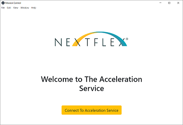
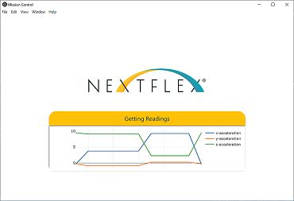

# ble-acceleration-service

<table style="border: none;">
  <tr>
    <td rowspan="2">
      
    </td>
    <td>
      
    </td>
  </tr>
  <tr>
    <td>
      
    </td>
  </tr>
  </col>
</table>

_Demonstration of Application Connecting to BLE Service_

## Description

SES Custom BLE service built on an nRF5280 Development Kit which provides accelerometer readings.
Electron application that connects to the service.

The BLE service connects to the web via a Gateway and the [nRF Cloud](https://nrfcloud.com/#/) service.

## Supplies

This project was built using the following hardware:
* nRF52840 Development Kit with micro USB cable
* SeggerEmbedded Studio for ARM
* MC3672 Accelerometer
* Assorted m2m jumper wires

## Data Visualization

The Data Visualization tool used for this project is [plotly.js](https://plotly.com/javascript/).

## Usage

This repo is meant to show an overview of all pieces of the project. Familiarity with the tools used is expected.
Building the full project requires the following steps:

- Build and run the embedded code on an nRF device. The easiest way to do this is with an nRF5280 DK and Segger
  Embedded studios. An alternative is to integrate the source code into another embedded development environment.

- Connect device to an nRF Cloud Gateway. Any Gateway will do. Read more about this service [here.](https://nrfcloud.com/#/)

- Build and run the front-end application. The source code will need to be updated to use your gateways UUIDs.
  The node_modules folder has been omitted to save space.

## API

The APIs used in this project are based on the [nRF Cloud API collection.](https://api.nrfcloud.com/v1/)
You can view them in detail in Postman.

